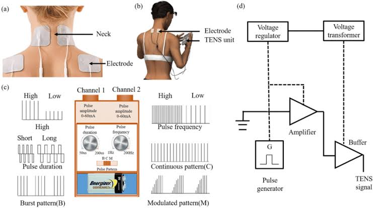
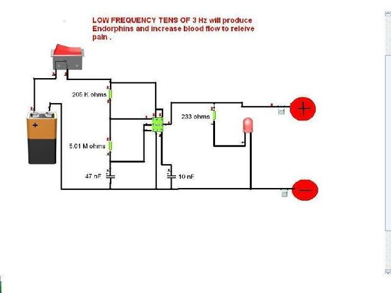
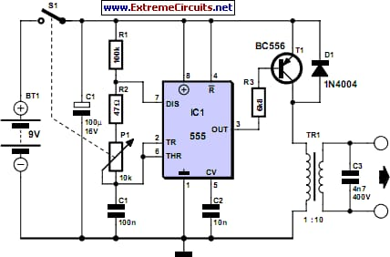

# TENS-System

<p align="center">
  
</p>

<p align="center">
  <strong>Open-Source Transcutaneous Electrical Nerve Stimulation (TENS) System</strong>
</p>

<p align="center">
  <a href="#features">Features</a> •
  <a href="#hardware-requirements">Hardware</a> •
  <a href="#installation">Installation</a> •
  <a href="#usage">Usage</a> •
  <a href="#3d-printed-enclosure">3D Parts</a> •
  <a href="#contributing">Contributing</a>
</p>

---

## 📖 Overview

The **TENS-System** is an open-source hardware and software project for building a Transcutaneous Electrical Nerve Stimulation (TENS) device. TENS therapy uses low-voltage electrical currents to provide pain relief by stimulating nerves through the skin.

This project provides everything you need to build your own TENS device, including:
- Arduino-based firmware for device control
- 3D printable enclosure designs
- Complete wiring and setup documentation

> ⚠️ **Disclaimer**: This project is intended for educational and research purposes only. It should not be used as a substitute for professional medical devices. Always consult with healthcare professionals before using any electrical stimulation device.

## ✨ Features

- **Multiple Therapy Modes**:
  - TENS Asymmetrical
  - Microcurrent
  - Diadynamic
  - NMS Burst
  - IFC (Interferential Current)
  - Russian Stimulation

- **Dual Channel Output**: Independent control of two stimulation channels
- **Adjustable Parameters**:
  - Time duration (0-35 minutes in 5-minute increments)
  - Stimulation intensity (16 levels per channel)
  - Frequency settings
  - Treatment cycle control
- **Serial/Bluetooth Control**: Control the device via serial commands or Bluetooth module
- **3D Printable Enclosure**: Custom-designed cases for both core and chest units

## 🔧 Hardware Requirements

### Core Components
| Component | Description | Quantity |
|-----------|-------------|----------|
| Arduino Board | Arduino Uno/Nano or compatible | 1 |
| TENS Module | Electrical stimulation output module | 1 |
| Bluetooth Module | HC-05 or HC-06 (optional) | 1 |
| Push Buttons | For manual control | 6 |
| TENS Electrodes | Self-adhesive pads | 4+ |
| Power Supply | 9V battery or DC adapter | 1 |
| Wires & Connectors | Jumper wires, electrode cables | As needed |

### Pin Configuration

```
Arduino Pin | Function
------------|--------------------
Pin 2       | Adjust Time
Pin 3       | Adjust Mode
Pin 4       | Adjust Frequency
Pin 5       | Adjust Cycle
Pin 6       | Channel 1 Increase
Pin 7       | Channel 1 Decrease
Pin 8       | Channel 2 Increase
Pin 9       | Channel 2 Decrease
```

## 💻 Software Requirements

- [Arduino IDE](https://www.arduino.cc/en/software) (version 1.8.x or later)
- USB drivers for your Arduino board
- (Optional) Bluetooth terminal app for wireless control

## 🚀 Installation

### 1. Clone the Repository

```bash
git clone https://github.com/kershrita/TENS-System.git
cd TENS-System
```

### 2. Upload Firmware to Arduino

1. Open `core-device/core-device.ino` in Arduino IDE
2. Select your board type under **Tools > Board**
3. Select the correct COM port under **Tools > Port**
4. Click the **Upload** button

### 3. Hardware Assembly

1. Connect the TENS module to the Arduino according to the pin configuration
2. Attach push buttons to the control pins
3. (Optional) Connect Bluetooth module to TX/RX pins
4. Print and assemble the 3D enclosure

## 📱 Usage

### Serial Commands

Control the TENS device by sending single-character commands via Serial Monitor (9600 baud) or Bluetooth:

| Command | Action | Description |
|---------|--------|-------------|
| `t` | Adjust Time | Cycles through time settings (0, 5, 10, 15, 20, 25, 30, 35 min) |
| `m` | Change Mode | Cycles through 6 therapy modes |
| `f` | Adjust Frequency | Modifies frequency settings |
| `c` | Start Cycle | Initiates the treatment cycle |
| `i` | Channel 1 + | Increases Channel 1 intensity |
| `d` | Channel 1 - | Decreases Channel 1 intensity |
| `+` | Channel 2 + | Increases Channel 2 intensity |
| `-` | Channel 2 - | Decreases Channel 2 intensity |

### Therapy Modes Explained

| Mode | Description | Typical Use |
|------|-------------|-------------|
| **TENS Asymmetrical** | Standard TENS with asymmetric waveform | General pain relief |
| **Microcurrent** | Very low-intensity current | Tissue healing, acute pain |
| **Diadynamic** | Dynamic modulated currents | Deep muscle pain |
| **NMS Burst** | Burst pulses for muscle stimulation | Muscle strengthening |
| **IFC** | Interferential current therapy | Deep tissue stimulation |
| **Russian** | High-frequency bursts | Muscle rehabilitation |

## 🖨️ 3D Printed Enclosure

The `3d parts/` directory contains STL files for printing custom enclosures:

| File | Description |
|------|-------------|
| `core-tens-box.stl` | Main enclosure body for the core unit |
| `core-tens-cover.stl` | Cover for the core unit |
| `chest-tens-box.stl` | Enclosure body for chest-mounted unit |
| `chest-tens-cover.stl` | Cover for chest unit |

### Printing Recommendations
- **Material**: PLA or PETG
- **Layer Height**: 0.2mm
- **Infill**: 20-30%
- **Supports**: May be required for some parts

## 📸 Project Images

<p align="center">
  
  
  
</p>

## 🤝 Contributing

Contributions are welcome! Here's how you can help:

1. **Fork** the repository
2. **Create** a feature branch (`git checkout -b feature/amazing-feature`)
3. **Commit** your changes (`git commit -m 'Add amazing feature'`)
4. **Push** to the branch (`git push origin feature/amazing-feature`)
5. **Open** a Pull Request

### Areas for Contribution
- Additional therapy modes
- Mobile app development
- Hardware improvements
- Documentation enhancements
- Bug fixes and optimizations

Please read [CONTRIBUTING.md](CONTRIBUTING.md) for detailed guidelines.

## 📄 License

This project is licensed under the MIT License - see the [LICENSE](LICENSE) file for details.

## 👤 Author

**Ashraf Abdulkhaliq**
- GitHub: [@kershrita](https://github.com/kershrita)

## 🙏 Acknowledgments

- The open-source hardware community
- Arduino project and community
- Contributors and testers

---

<p align="center">
  Made with ❤️ for the open-source community
</p>

<p align="center">
  ⭐ Star this repository if you find it helpful!
</p>